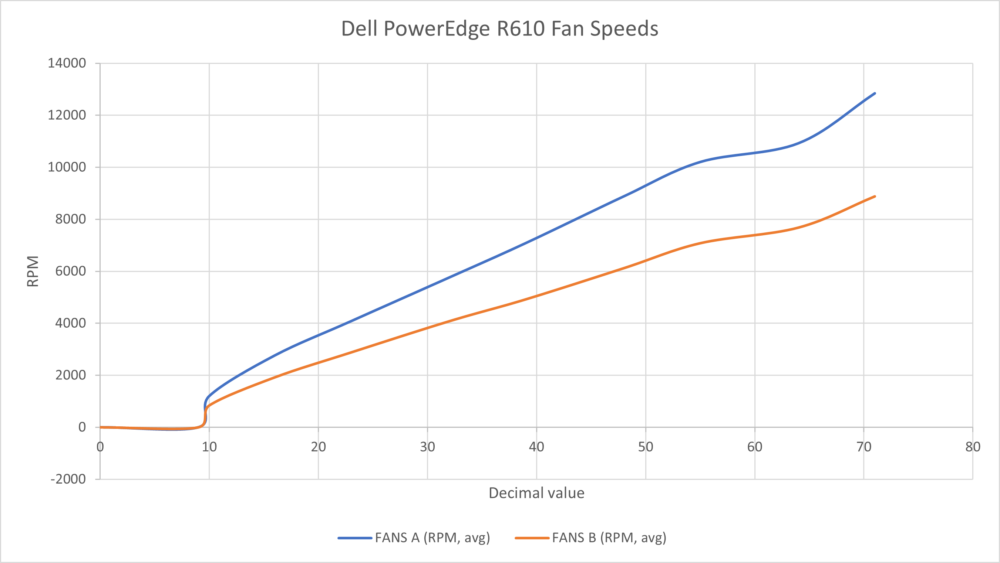

# INFO

This is a fork from spacelama's fan control script that was improved for the IPMI controller in the the Dell PowerEdge R610. Feel free to modify and improve.

Current changes:

-   sensor name
-   high fan speed value

---

Here is a table with the HEX values and the average fan speeds for the R610 (this is a shitty test but hey, it's _something_):
| HEX | Decimal | FANS A (RPM, avg) | FANS B (RPM, avg) |
|-----|---------|-------------------|-------------------|
| 0 | 0 | 0 | 0 |
| 9 | 9 | 0 | 0 |
| a | 10 | 1200 | 840 |
| 10 | 16 | 2760 | 1920 |
| 17 | 23 | 4080 | 2880 |
| 20 | 32 | 5760 | 4080 |
| 27 | 39 | 7080 | 4920 |
| 30 | 48 | 8880 | 6120 |
| 37 | 55 | 10200 | 7080 |
| 40 | 64 | 10920 | 7680 |
| 47 | 71 | 12840 | 8880 |

---

These files are provided "as is", and I take no responsibility if they break something on your end.
